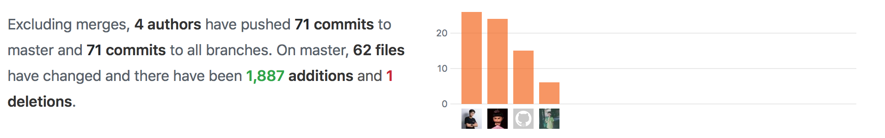

# BATTLESHIP PROJECT
*This project is a part of Software Specification & Design lecture. Battleship is a multiplayer game that created via JAVA. Players have to shoot the missile to opponent's ships. Player who can shoot all of opponent's ships is the winner. 
Note: We used Processing https://processing.org as the library sources in this project*

## Instruction (How to play)
1. Click run 
2. It shows two windows, but they are on cover each others. Player has to seperate the windows to play.
3. One player has to click on Player 1 while another has to click on Player 2 at the other window, for connecting server.
4. Each players are able to place their ships. Until all of the ships are placed, players have to click on "Ready" button.
5. Each players have to guess which positions of other's ship and shoot the missile by clicking on the field space.
6. Player who can destroy all of oppenent's ships first is the winner.

## Members
- Rakkan Tiasakul 5810546013
- Jirayut Leeupathumvong 5810546617
- Tunya Wittayasiripaiboon 5810546676

## Design patterns
- Observer : Used when there's method notify() is called for attacking enemy's ships.
- Singleton : Used to solve the problems from conencting between server and client class.
- Decorator : Used for creating Ship and decorating all of classes that belonged to Ship.

## Principles
- Single Responsibility Principle : Each classes take responsible of themselves. 
- Open/closed Principle : There're classes which use "Extends" , and they could be modified too.

## Members' role
- Rakkan Tiasakul 5810546013
  - Write README
  - Create network game and connect multiplayer 
- Jirayut Leeupathumvong 5810546617
  - Design Unit and Background
  - Game Logic
- Tunya Wittayasiripaiboon 5810546676
  - Game UI
  - Game Logic
  

  

This image describes committing of each members. 
*(Rakkant and Rakkan Tiasakul are the same contributer.)*
